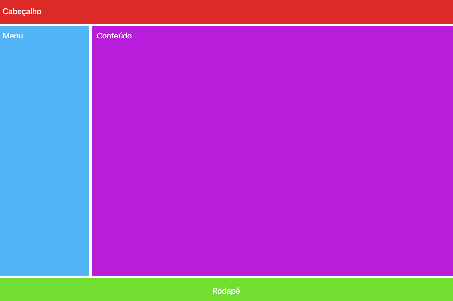

# Prática: Layout com CSS Grid

Nesta prática, a tarefa será recriar visualmente, na tela do navegador, o que consta na imagem acima. Deverá ser usado CSS Grid nesta construção.

Caso tenha dúvidas ou problemas com a prática, peça ajuda ao instrutor ou tente estudá-la junto de seu mentor.

